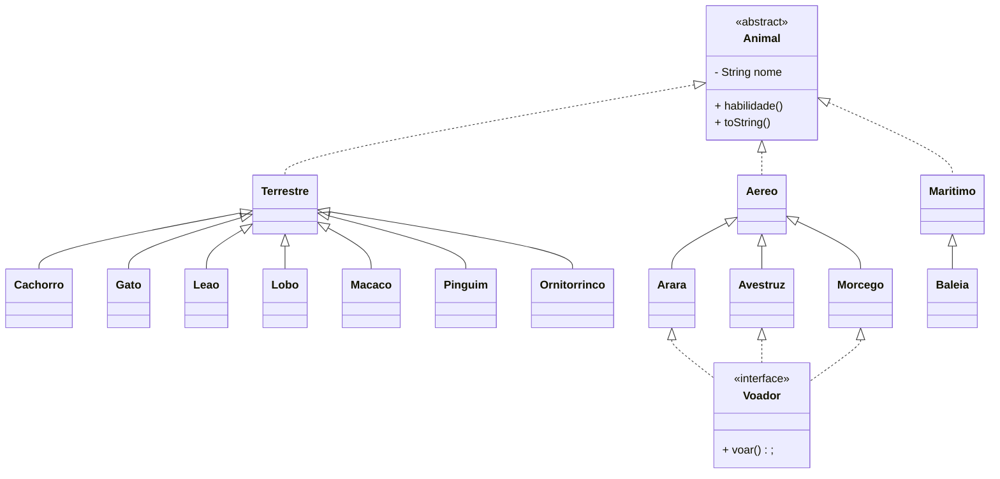

```mermaid
classDiagram
    class Animal{
        <<abstract>>
        - String nome
        + habilidade()
        + toString()
    }

    Aereo <|-- Arara
    Aereo <|-- Avestruz
    Maritimo <|-- Baleia
    Terrestre <|-- Cachorro
    Terrestre <|-- Gato
    Terrestre <|-- Leao
    Terrestre <|-- Lobo
    Terrestre <|-- Macaco
    Aereo <|-- Morcego
    Terrestre <|-- Pinguim
    Terrestre <|-- Ornitorrinco

    Animal <|.. Terrestre
    Animal <|.. Aereo
    Animal <|.. Maritimo

    class Arara{
        
    }
    class Avestruz{
        
    }
    class Baleia{

    }
    class Cachorro{

    }
    class Gato{

    }
    class Leao{

    }
    class Lobo{

    }
    class Macaco{

    }
    class Morcego{

    }
    class Pinguim{

    }
    class Ornitorrinco{

    }

    class Voador{
        <<interface>>
        + voar();
    }

    Arara <|.. Voador
    Avestruz <|.. Voador
    Morcego <|.. Voador
```