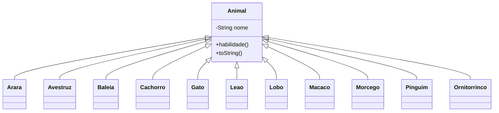

```mermaid
classDiagram
    Animal <|-- Arara
    Animal <|-- Avestruz
    Animal <|-- Baleia
    Animal <|-- Cachorro
    Animal <|-- Gato
    Animal <|-- Leao
    Animal <|-- Lobo
    Animal <|-- Macaco
    Animal <|-- Morcego
    Animal <|-- Pinguim
    Animal <|-- Ornitorrinco
    Animal : -String nome
    Animal: +habilidade()
    Animal: +toString()
    class Arara{
        
    }
    class Avestruz{
        
    }
    class Baleia{

    }
    class Cachorro{

    }
    class Gato{

    }
    class Leao{

    }
    class Lobo{

    }
    class Macaco{

    }
    class Morcego{

    }
    class Pinguim{

    }
    class Ornitorrinco{

    }
```