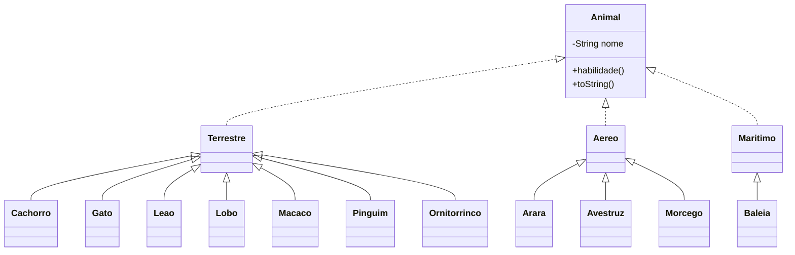

```mermaid
classDiagram
    Aereo <|-- Arara
    Aereo <|-- Avestruz
    Maritimo <|-- Baleia
    Terrestre <|-- Cachorro
    Terrestre <|-- Gato
    Terrestre <|-- Leao
    Terrestre <|-- Lobo
    Terrestre <|-- Macaco
    Aereo <|-- Morcego
    Terrestre <|-- Pinguim
    Terrestre <|-- Ornitorrinco

    Animal <|.. Terrestre
    Animal <|.. Aereo
    Animal <|.. Maritimo

    Animal : -String nome
    Animal: +habilidade()
    Animal: +toString()
    class Arara{
        
    }
    class Avestruz{
        
    }
    class Baleia{

    }
    class Cachorro{

    }
    class Gato{

    }
    class Leao{

    }
    class Lobo{

    }
    class Macaco{

    }
    class Morcego{

    }
    class Pinguim{

    }
    class Ornitorrinco{

    }
```